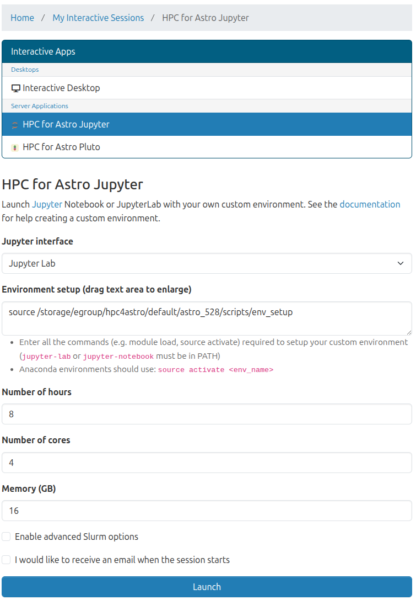

# Astro 528, Lab 6

Before starting this lab, make sure you've successfully gotten setup to use git, Julia and Pluto.
The first lab contained detailed instructions for using the Jupyter Lab server to work with Pluto notebooks.  

If you'll be using the Lynx Collab portal to access the JupyterLab server, then you need to request multiple processor cores when you first submit the request for the JupyterLab session using the box labeled "Number of Cores", i.e. before you start executing cells in this notebook.


While we're in class (or the night before the lab is due), please ask for just 4 cores, since there could be ~20 of us using the system at once.
When working on the lab (or your project) outside of class, feel free to try benchmarking the code using 8 cores, 16 or 32 cores for brief time (e.g., a few minutes).  (Our class is limited to two nodes with 48 cores each.)  For sessions where you ask for several cores, then please be extra diligent about closing your session promptly when you're done, so they are made available for other users.

Remember, that you need follow the provided link to create your own private copy of this lab's repository on GitHub.com.   See the
[help on the course website](https://psuastro528.github.io/Fall2025/tips/labs/) for instructions on cloning, committing, pushing and reviewing your work.


## Exercise 1:  [Parallelization for Multi-Core Workstations via Multiple-Threads](https://psuastro528.github.io/lab6/ex1.html)
### Goals:
- Choose an appropriate number of worker processors for your compute node
- Parallelize code using ThreadsX.map and ThreadsX.mapreduce
- Parallelize code using Threads.@threads
- Parallelize code using ThreadsX.foreach
- Parallelize code using FLoops & ThreadedEx

From a Pluto session, work through ex1.jl


## Exercise 2:  [Parallelization for Multi-Core Workstations via Multiple Processes](https://psuastro528.github.io/lab6/ex2.html)
### Goals:
- Load code and packages on worker nodes
- Parallelize code using pmap
- Parallelize code using SharedArray's
- Parallelize code using map and mapreduce on DistributedArray's
- Parallelize code using @distributed for loop
- Parallelize code using @distributed for loop with a reducing operation
- Parallelize code using FLoops & DistributedEx

From a **Jupyter** session, work through ex2.ipynb.
Once you've finished working on the Jupyter notebook for this your lab, save it.  In addition to commiting your Jupyter notebook (the .ipynb file), please also create a markdown version of your Jupyter notebook (that will make it much easier to provide feedback on).  You can do that by running
```bash
julia --project=. -e 'using Weave; convert_doc("ex2.ipynb","ex2.jmd")'

git add ex2.jmd  
git commit -m "Adding markdown version of Jupyter notebook for ex2"
git push
```
